# Architecture MOBILI

Document de référence : vue d’ensemble, stack, audit synthétique et **diagrammes Mermaid** (globaux puis par compartiment).

---

## 1. Synthèse structurelle

- **Pattern** : monolithe modulaire **Maven** (`mobili-core` + **`mobili-boot`** exécutable). Une seule API Spring Boot déployable ; le domaine métier vit surtout dans `mobili-boot` (`api/`, `module/`, `infrastructure/`).
- **Frontend** : workspace **Angular** — appli voyageur, appli **`mobili-business`**, lib **`mobili-shared`**.
- **Données** : **PostgreSQL** + migrations **Flyway** ; **Redis** optionnel (rate limiting distribué).
- **Paiement** : **FedaPay** (SDK Java + webhook + vérification côté serveur).

### Dossiers principaux (racine)

| Dossier | Rôle |
|---------|------|
| `backend/` | Reactor Maven : `mobili-core` (partagé léger), `mobili-boot` (REST, sécurité, JPA, Flyway). |
| `frontend/` | Angular : appli voyageur, `mobili-business`, `mobili-shared`, e2e Playwright. |
| `docs/` | Sécurité, Redis, QA, modularisation. |
| `scripts/` | `verify` (Maven + build + tests front). |
| `docker-compose.yml` | Dev front (container Angular + watch). |

---

## 2. Technologies clés

**Backend** : Java 21, Spring Boot 4.x, Spring Web MVC, Spring Security (JWT stateless), Spring Data JPA, PostgreSQL, Flyway, Redis (optionnel), JJWT, MapStruct, Lombok, Actuator + Prometheus, FedaPay (SDK), dotenv-java.

**Frontend** : Angular ~21, RxJS, TypeScript, intercepteurs HTTP, guards, Tailwind (outil), Playwright (e2e).

---

## 3. Patterns identifiables

Injection de dépendances (Spring / Angular), couche **service** transactionnelle (`@Transactional`), **repositories** Spring Data, **DTO + mappers**, filtre **JWT** + rate limit dans la chaîne Security, adaptation **FedaPay** via un service dédié, intercepteur front pour Bearer + refresh.

---

## 4. Audit synthétique (rappel)

- **Points d’attention lancement** : configuration FedaPay (environnement / URLs) à **externaliser** en prod ; dépendance SDK à **figer** (éviter `SNAPSHOT` Jitpack non reproductible).
- **Scalabilité** : activer **Redis** pour quotas globaux derrière load balancer.
- **Sécurité** : renforcer **idempotence** des confirmations paiement ; aligner stockage tokens client (mobile) avec les bonnes pratiques documentées dans le dépôt.

---

## 5. Diagrammes globaux

### 5.1 Contexte système

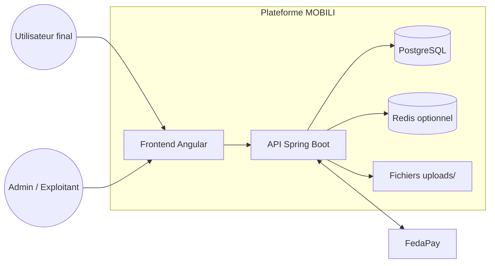

### 5.2 Conteneurs (applications + données)

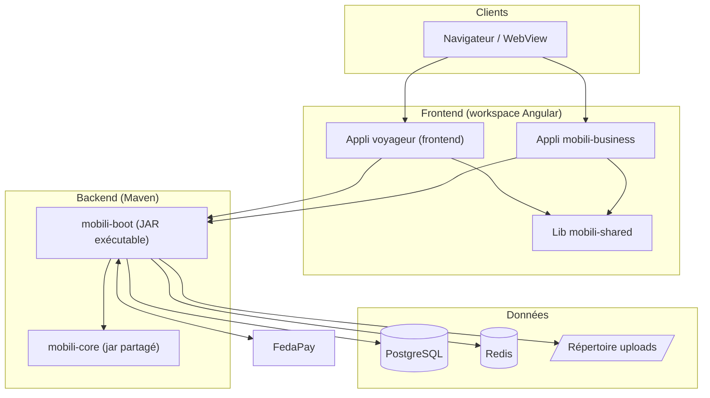

### 5.3 Flux critique : auth → réservation → paiement → billets

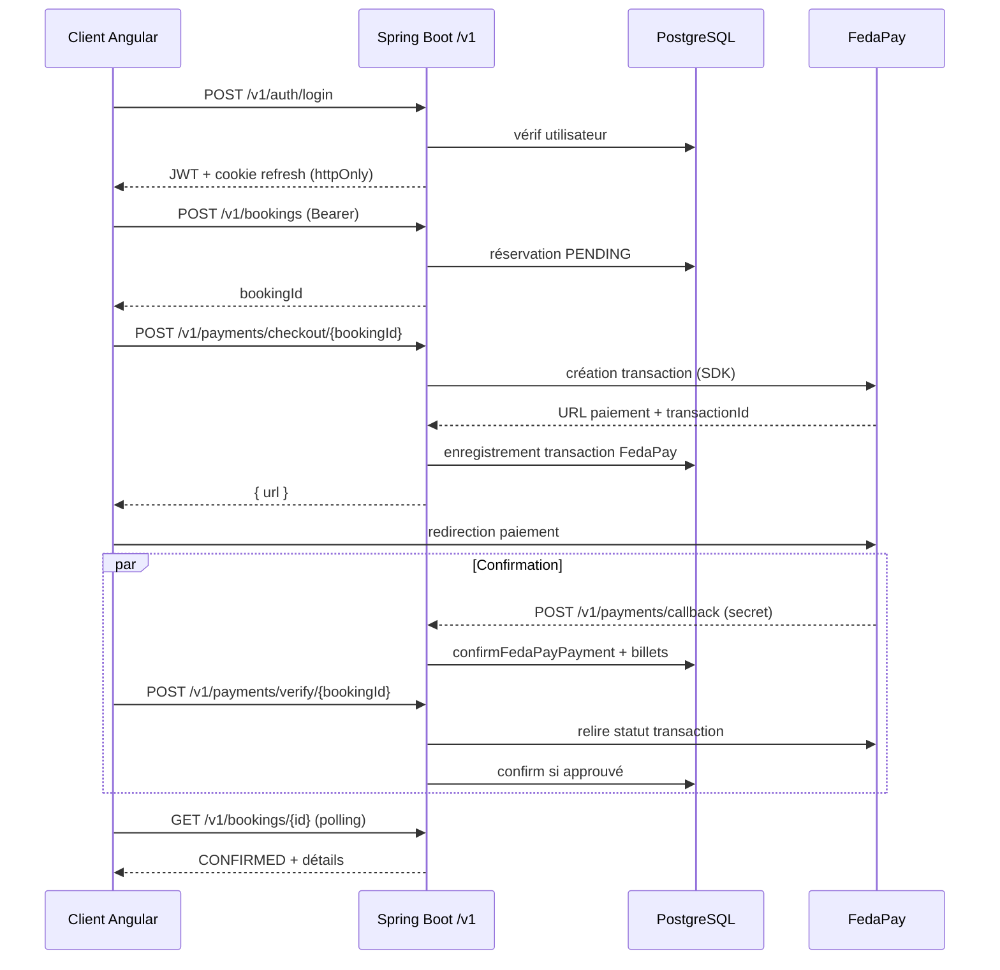

---

## 6. Compartiment : Frontend Angular

### 6.1 Deux applis + lib partagée

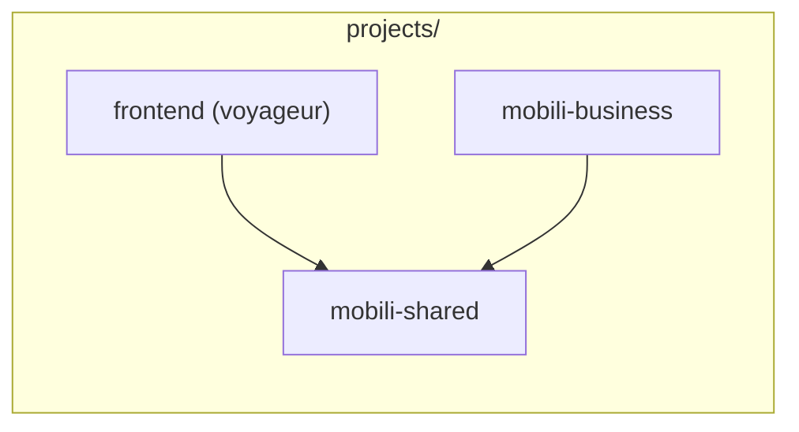

### 6.2 Structure interne `frontend/src/app`

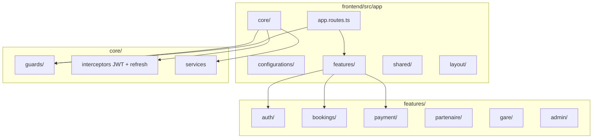

### 6.3 Chaîne HTTP client (intercepteur)

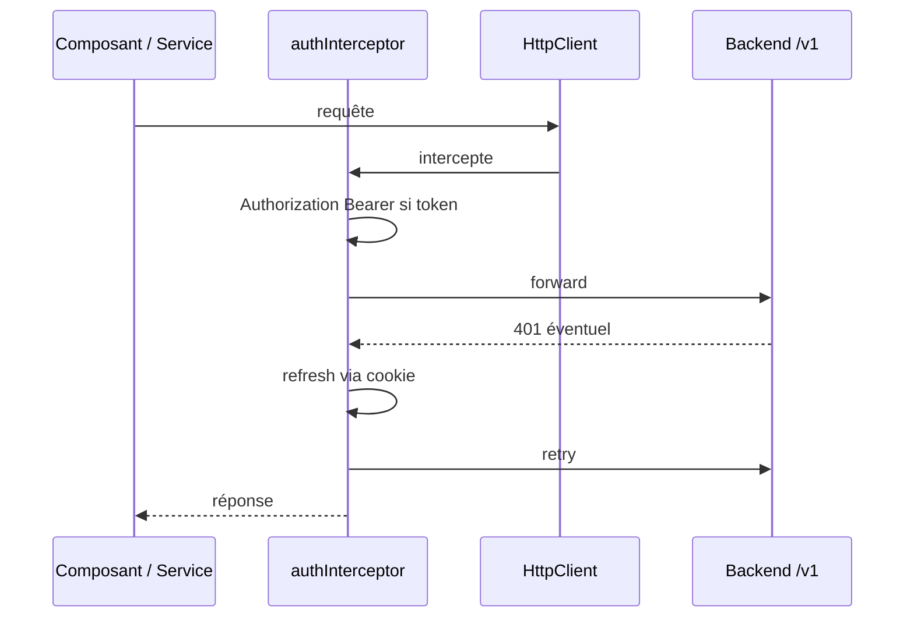

---

## 7. Compartiment : Backend Spring Boot

### 7.1 Modules Maven

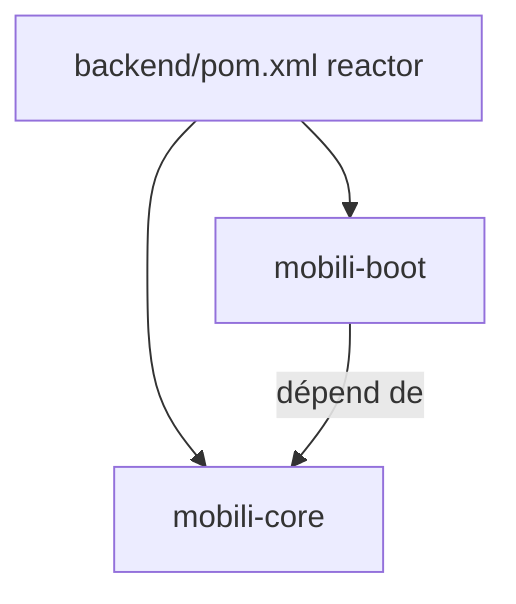

### 7.2 Couches dans `mobili-boot`

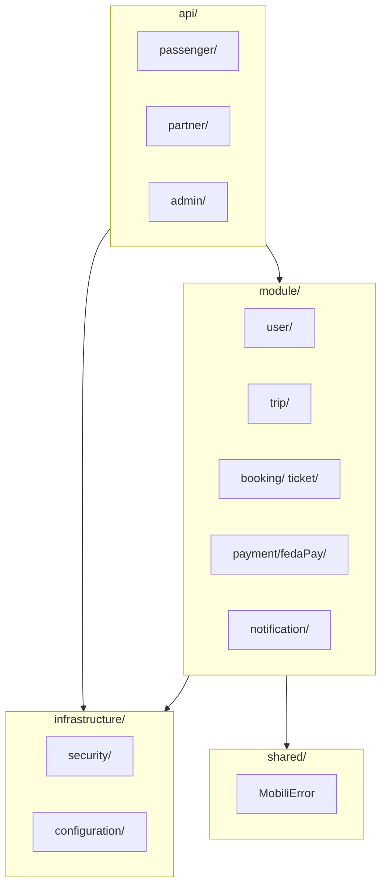

### 7.3 Domaines `module/*` (aperçu)

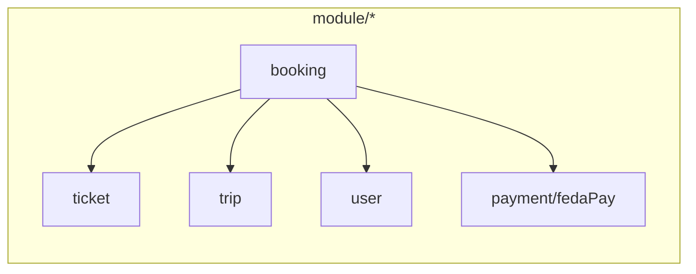

---

## 8. Compartiment : données & fichiers

### 8.1 Persistance

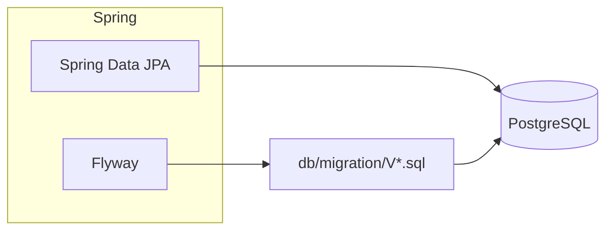

### 8.2 Uploads et médias

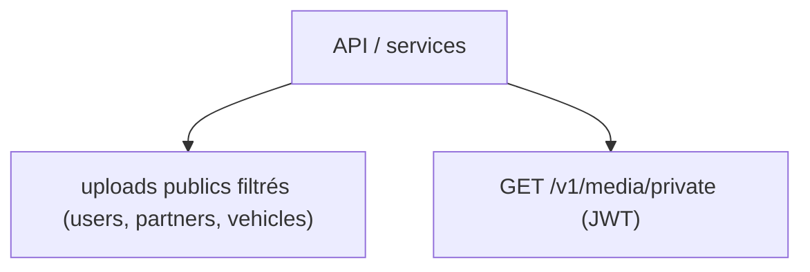

### 8.3 Rate limiting

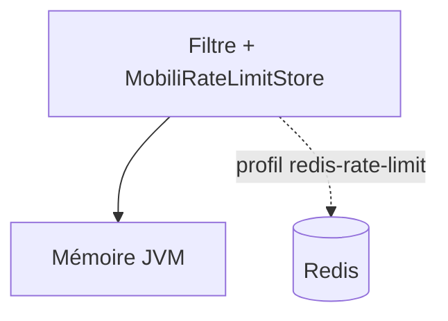

---

## 9. Compartiment : FedaPay & paiement

### 9.1 Composants

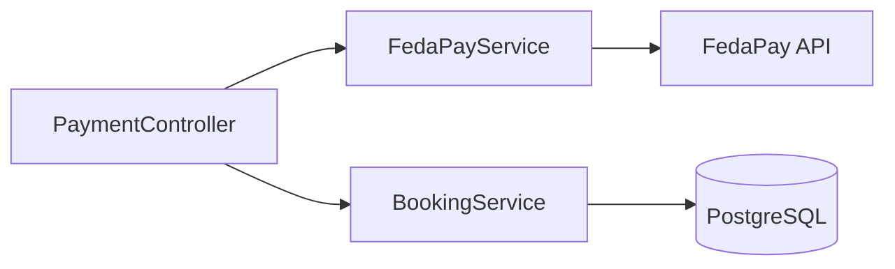

### 9.2 Séquence paiement détaillée

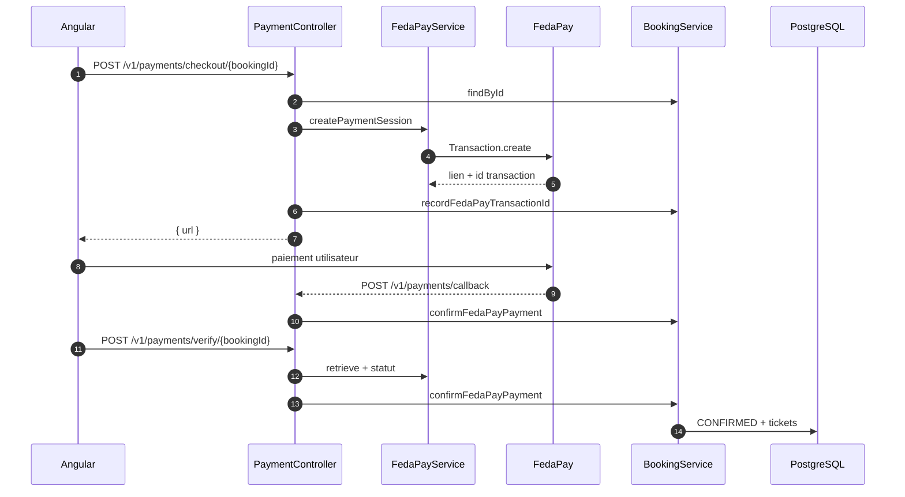

---

## 10. Compartiment : sécurité

### 10.1 Chaîne de filtres

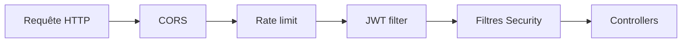

### 10.2 Modèle d’autorisation (résumé)

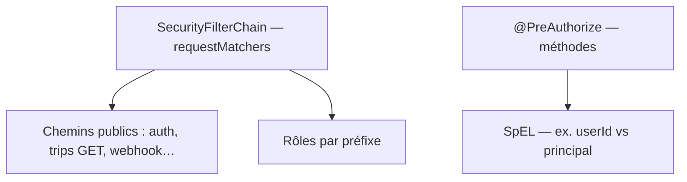

---

## 11. Compartiment : développement Docker (front)

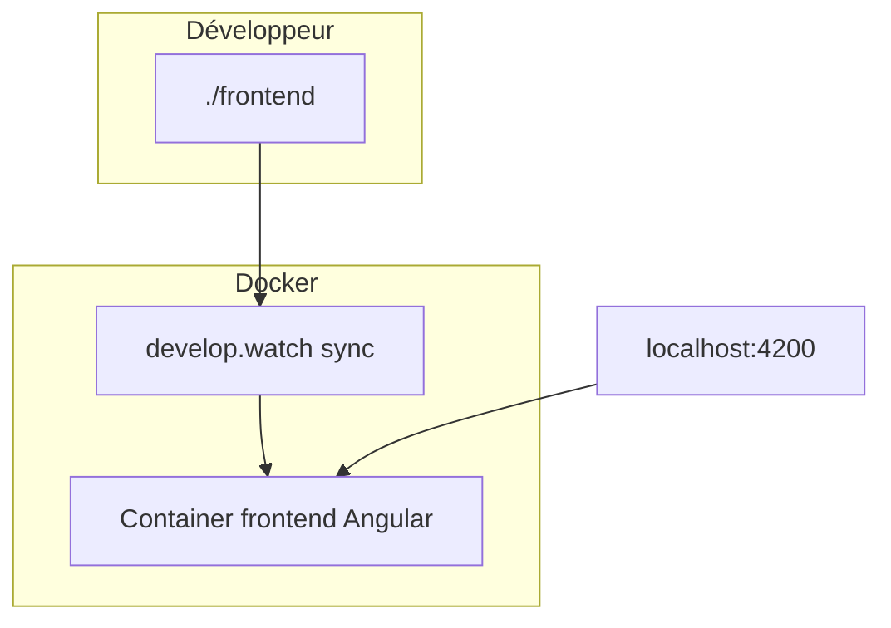

---

## Références code utiles

| Sujet | Emplacement indicatif |
|--------|------------------------|
| Chemins API centralisés | `backend/mobili-core/.../MobiliApiPaths.java` |
| Règles Security | `backend/mobili-boot/.../SecurityConfig.java` |
| Paiement / webhook | `backend/mobili-boot/.../payment/PaymentController.java` |
| Service FedaPay | `backend/mobili-boot/.../fedaPay/service/FedaPayService.java` |
| Confirmation + billets | `backend/mobili-boot/.../booking/service/BookingService.java` |

Pour affiner les diagrammes : [Mermaid Live Editor](https://mermaid.live).
